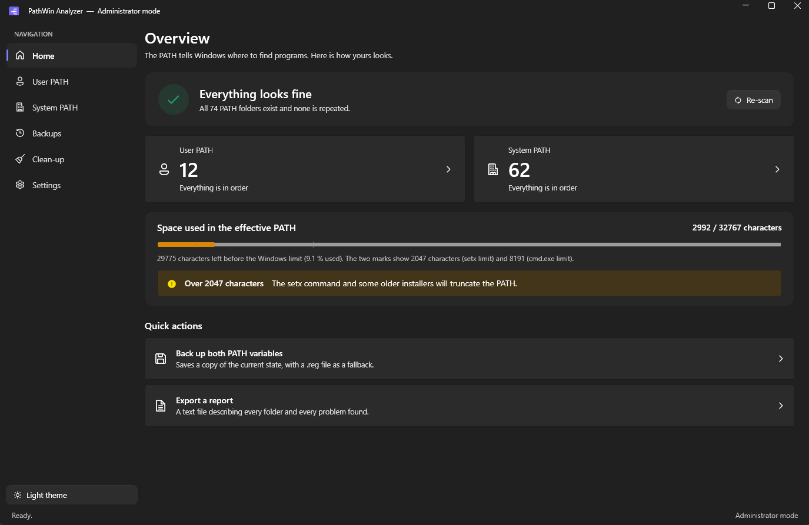

# PathWin Analyzer

A small Windows app to inspect, clean and edit the **user** and **system** `PATH` variables — in the spirit of
Rapid Environment Editor, with a modern Fluent interface.



## Features

- Checks every folder: missing, empty, no executable, unresolved `%VAR%`, invalid characters, duplicates inside each PATH and across both
- Size of each PATH against the Windows limits (2047 `setx` / 8191 `cmd.exe` / 32767 absolute)
- Full editing: add, browse, reorder, remove, clean up — nothing is written until you click **Apply**
- Automatic backup (JSON + `.reg`) before every change, with restore
- Text report export
- English and French, light and dark theme
- Starts without elevation; the system PATH stays read-only until you relaunch as administrator

## Install

From the [latest release](../../releases/latest):

| File | |
|---|---|
| `PathWinAnalyzer-Setup.exe` | Installer — Start menu shortcut, uninstaller, for every user or just you |
| `PathWinAnalyzer-portable.exe` | The app as a single file, nothing to install |

Both contain everything they need: no runtime to install first.
Backups and settings stay in `%LOCALAPPDATA%\PathAnalyzer` and the uninstaller never touches them.

## Build

```
dotnet publish PathAnalyzer -c Release -r win-x64 -p:SelfContained=false -p:PublishSingleFile=true -o dist
```

## License

MIT
